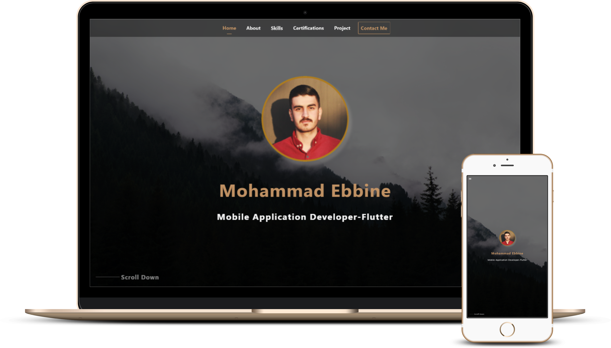

<h2 align="center">
  Portfolio Website
</h2>

<h4>This repository contains code for my portfolio website which is made using flutter.</h4>

<div align="center">
  
</div>


## Built With
---

My personal portfolio [Colonal](https://my-profile-64f92.web.app/#/) which features some of my github projects as well as my resume and technical skills.<br/>

### This project was built using these technologies.

- Flutter 
- Firebase
- State management (Bloc)

### Features

**📱 Fully Responsive**

**📖 Clean Architecture**

**🎨 Adobe XD design**

---

## Development Setup
Clone the repository and run the following commands:
```
git clone https://github.com/colonal/My-Portfolio.git
cd My-Portfolio
flutter pub get
```
#
### Firebase set up

##### Download Firebase CLI [here](https://firebase.google.com/docs/cli#setup_update_cli)

##### Add Firebase to your Flutter app [here](https://firebase.google.com/docs/flutter/setup?platform=ios)

##### Add data in firebase check [data samples](https://github.com/colonal/My-Portfolio/tree/main/lib/data%20samples)  View data format
#
Run App
```
flutter run
```
--- 


### Show your support

Give a ⭐ if you like this website!


